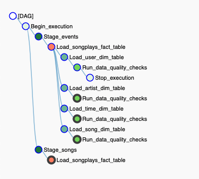
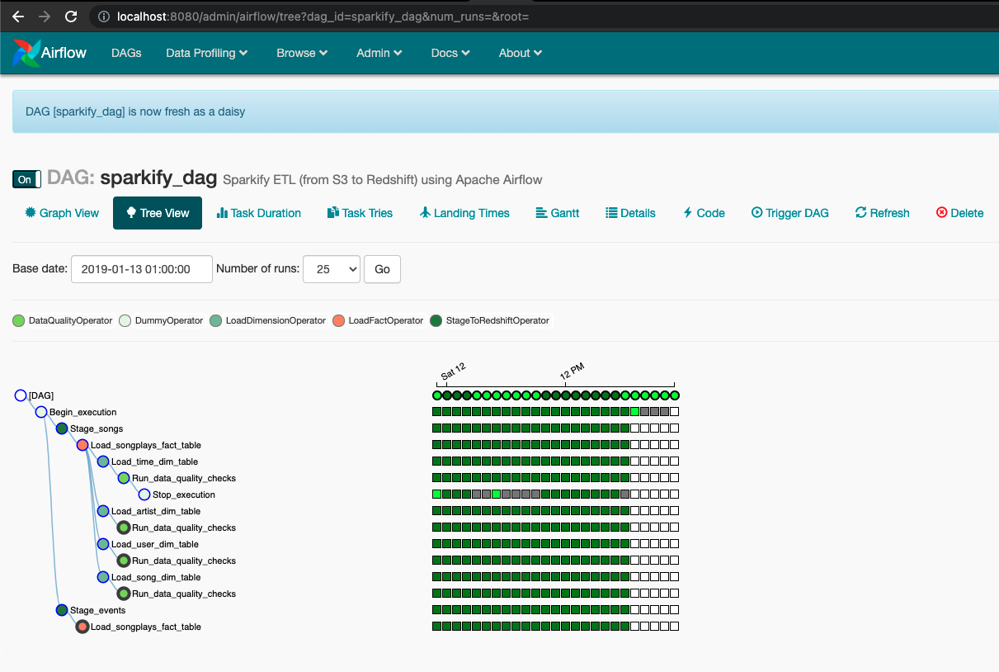

# Project description
As an evolution of [Project 4](https://github.com/hedcler/udacity-dataengineer-project4), a music streaming company, Sparkify, has decided that it is time to introduce more automation and monitoring to their data warehouse ETL pipelines and come to the conclusion that the best tool to achieve this is Apache Airflow.

They have decided to bring you into the project and expect to create high grade data pipelines that are dynamic and built from reusable tasks, can be monitored, and allow easy backfills. They have also noted that the data quality plays a big part when analyses are executed on top the data warehouse and want to run tests against their datasets after the ETL steps have been executed to catch any discrepancies in the datasets.

The source data resides in S3 and needs to be processed in Sparkify's data warehouse in Amazon Redshift. The source datasets consist of JSON logs that tell about user activity in the application and JSON metadata about the songs the users listen to.

As their data engineer, I was tasked tasked with building an ETL pipeline that extracts their data from S3, processes them using Airflow, and loads the data back into S3 as a set of dimensional tables. This will allow their analytics team to continue finding insights in what songs their users are listening to.

This project will introduce the core concepts of Apache Airflow. To complete the project, we need to create our own custom operators to perform tasks such as staging the data, filling the data warehouse, and running checks on the data as the final step.

**DAG Graph View**


**DAG Tree View**




## Step 1 - Configure the project

### Step 1.1 - Project dependencies
It's good to start with airflow on docker to avoid too much environment challenges. 
Install the [Docker](https://docs.docker.com/get-docker/) and [Docker-Compose](https://docs.docker.com/compose/install/) on your host.

### Step 1.2 - Run Apache Airflow on Docker
With Docker installed and running, and Docker-Composer installed, run the follow command on your terminal:

```sh
$ docker-compose up -d
```

This command will start the Apache Airflow, and it will be accessible on http://localhost:8080, to login use the follow credentials:

```
username: ayrflow
password: ayrflow
```
### Step 1.3 - Configure Airflow Connections

[Click Here](./docs/add-airflow-connection.md) to see how configure Airflow Connections.


## Step 2 - Reading the data

### Song Dataset
The songs dataset is a subset of real data from the [Million Song Dataset](https://labrosa.ee.columbia.edu/millionsong). Each file is in JSON format and contains metadata about a song and the artist of that song. The files are partitioned by the first three letters of each song's track ID. For example, here are filepaths to two files in this dataset.

```
song_data/A/A/B/TRAABJL12903CDCF1A.json
song_data/A/B/C/TRABCEI128F424C983.json
```

And below is an example of what a single song file, TRAABJL12903CDCF1A.json, looks like.

```
{"num_songs": 1, "artist_id": "ARJIE2Y1187B994AB7", "artist_latitude": null, "artist_longitude": null, "artist_location": "", "artist_name": "Line Renaud", "song_id": "SOUPIRU12A6D4FA1E1", "title": "Der Kleine Dompfaff", "duration": 152.92036, "year": 0}
```

**IMPORTANT:** As a example we will work with local zip files that needs to be unziped.

### Log Dataset

The log dataset consists of log files in JSON format generated by this event simulator based on the songs in the dataset above. These simulate app activity logs from an imaginary music streaming app based on configuration settings.

The log files in the dataset you'll be working with are partitioned by year and month. For example, here are filepaths to two files in this dataset.

```
log_data/2018/11/2018-11-12-events.json
log_data/2018/11/2018-11-13-events.json
```

And below is an example of what the data in a log file, 2018-11-12-events.json, looks like.


## Data Quality
To ensure the tables were loaded, a data quality checking is performed to count the total records each table has.

## IAC - Infrastructure As Code [OPTIONAL]

If you want to automatize Redshift Cluster creation:

1. Rename the `redshift.cfg.example` to `redshift.cfg`
2. Execute the file `iac.py`, that will create infrastructure and update configurations on file
3. Execute the file `create_tables.py` that will import queris from `sql_queries.py`
4. Configure your Apache Airflow Connections with data present on section `CLUSTER` of file `redshift.cfg` .

To execute `iac.py` you'll need to provide `key`, `secret`, and `region` on `[AWS]` section of file `redshift.cfg`.

Now you can run your DAG on Apache Airflow.

## Expected result

